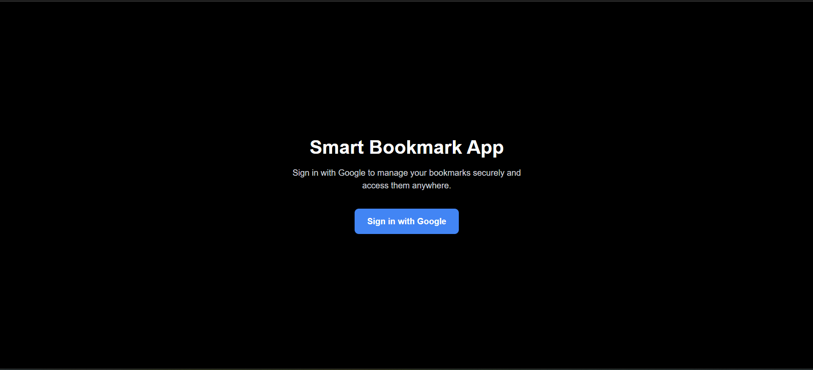
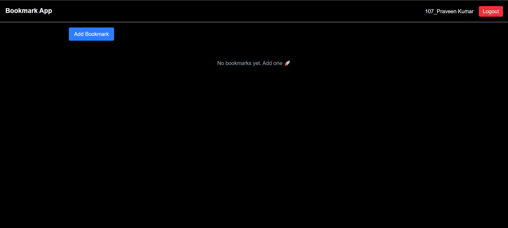
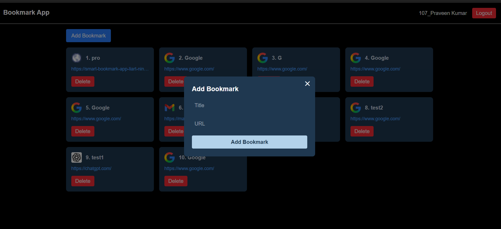
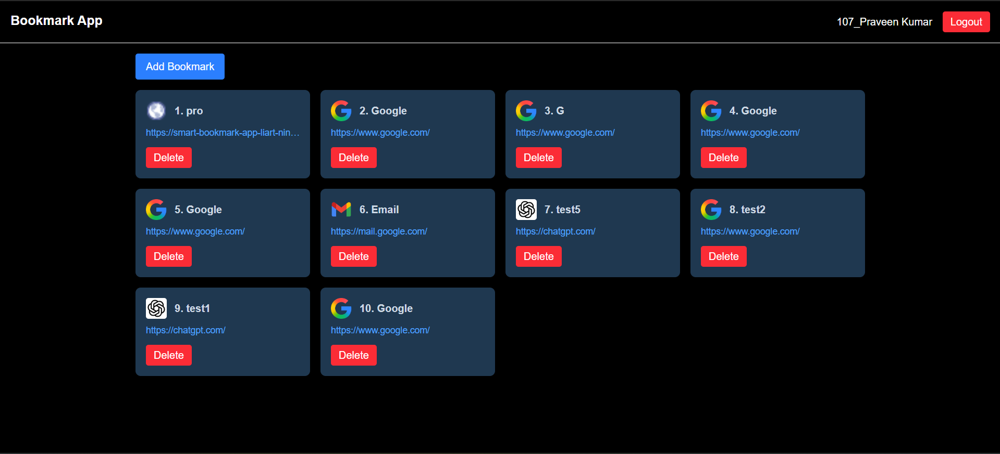

# Smart Bookmark App

A simple bookmark manager built using Next.js App Router, Supabase Auth, Realtime Database, and Tailwind CSS.

Users can sign in with Google, add bookmarks, view them in real time, and delete their own bookmarks.

---

## Live Demo

Deployed on Vercel  
Live URL: https://smart-bookmark-app-liart-nine.vercel.app/

GitHub Repo: https://github.com/PraveenGPK1206/Smart-Bookmark-App

---

## Tech Stack

- Next.js (App Router)
- Supabase (Auth, Database, Realtime)
- Tailwind CSS
- Google OAuth
- Deployment: Vercel

---

## Features

- Google login (no email/password)
- Add bookmark (title + URL)
- Bookmarks are private per user
- Real-time updates without refresh
- Delete bookmarks
- Responsive UI

---

## Screenshots

### Login Page

### Dashboard

### Add Bookmark Dialog

### Bookmark List

---

## How it Works

1. User logs in using Google OAuth via Supabase.
2. Supabase stores user session.
3. Bookmarks are stored in the `bookmarks` table with `user_id`.
4. Real-time subscription listens for database changes.
5. UI updates automatically without page refresh.

---

## Database Structure

Table: bookmarks

- id (uuid)
- title (text)
- url (text)
- user_id (uuid)
- created_at (timestamp)

Row Level Security (RLS) ensures users only access their own bookmarks.

---

## Problems Faced & Solutions

### 1. Google OAuth redirect issue
**Problem:** After login, the app was not redirecting correctly.

**Solution:**  
Configured correct redirect URLs in Supabase Auth settings and Vercel environment variables.

---

### 2. Real-time updates not working initially
**Problem:** UI was not updating automatically.

**Solution:**  
Used Supabase Realtime subscription with `postgres_changes` and refetched bookmarks.

---

### 3. User privacy (important requirement)
**Problem:** All users could see all bookmarks initially.

**Solution:**  
Enabled Row Level Security (RLS) and added policy:

Policies used:

- SELECT → auth.uid() = user_id  
- INSERT → auth.uid() = user_id  
- DELETE → auth.uid() = user_id

---

## Local Setup

1. Clone the repository

git clone https://github.com/PraveenGPK1206/Smart-Bookmark-App

2. Install dependencies

npm install

3. Create .env.local file and add:

NEXT_PUBLIC_SUPABASE_URL=your_supabase_url  
NEXT_PUBLIC_SUPABASE_ANON_KEY=your_supabase_anon_key

4. Run the project

npm run dev